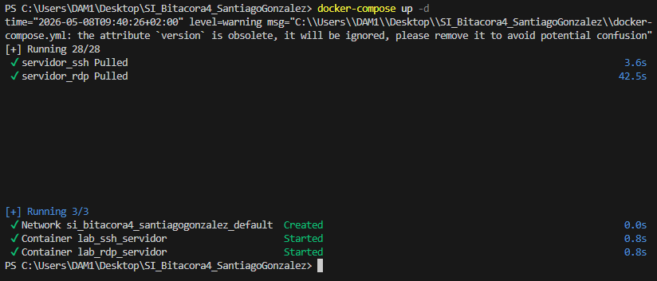
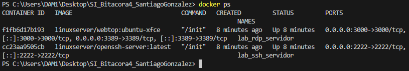
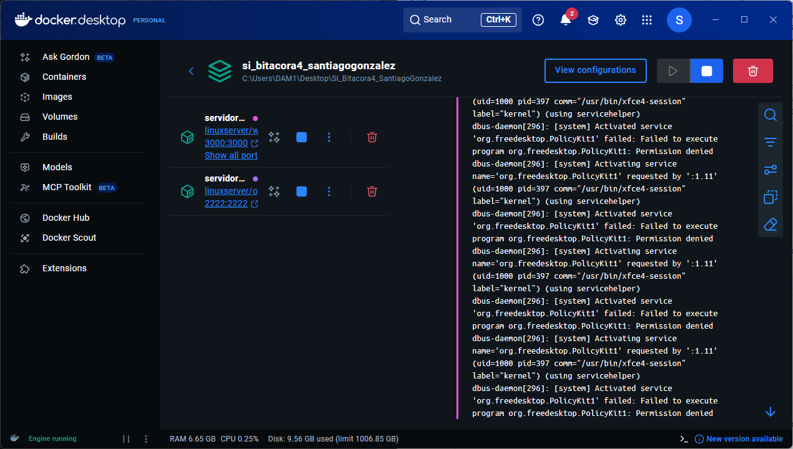
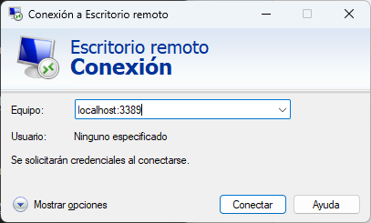

# Bitácora Técnica IV. Laboratorio de Teletransportación Digital (SSH y RDP)
## Tarea 1: Despliegue de la Infraestructura
He creado una carpeta llamada _SI_Bitacora4_SantiagoGonzalez_, en ella he creado el archivo _docker-compose.yml_ como se indica en la práctica.

Con el _Docker Desktop_ abierto, he ejecutado en la terminal el comando _docker-compose up -d_.

Luego he verificado que los contenedores están corriendo con _docker ps_ y dentro de la aplicación _Docker Desktop_.

## 3.1. SSH: Forjando la Llave Maestra
### Paso A (Conexión Inicial)
Para conectarme al contenedor he usado el comando _ssh alumno@localhost -p 2222_ con contraseña _sistemas_informaticos_.

### Paso B (Generación de Identidad)
Luego he generado un par de llaves con el comando _ssh-keygen -t ed25519 -C "mi_correo@ejemplo.com"_

### Paso C (Transferencia)
Para copiar mi clave pública al servidor he usado el comando _ssh-copy-id -p 2222 alumno@localhost_

## 3.2. RDP: El Escritorio en tu Navegador
Me he intentado conectar por Escritorio remoto con la aplicación _MSTSC_ de Windows por la dirección _localhost:3389_.

Pero me salía un error de que el equipo no podía conectarse ya que hay una sesion de consola en curso.

Por ello me fui a la dirección _http://localhost:3000_
