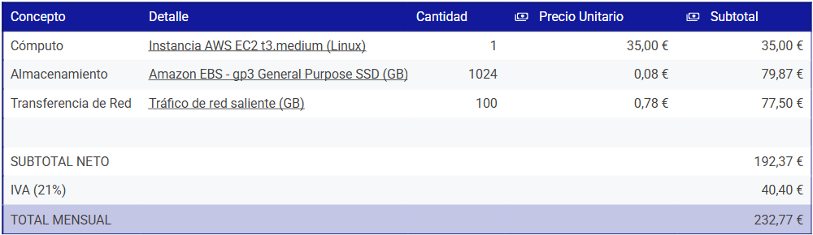

# 

# 

# UD07. T01. Sprint 1: El Marco Legal y la Estructura del "Relato"

## Santiago González González 

Desarrollo de Aplicaciones Aplicaciones Multiplataforma  
15/05/26

# ÍNDICE

[**1 Análisis de Necesidades**](#análisis-de-necesidades)

[1.1. Contexto y Problemática Actual](#1.1.contexto-y-problemática-actual)

[1.2. Solución Propuesta: Infraestructura Híbrida Docker-Guacamole](#1.2.-solución-propuesta:-infraestructura-híbrida-docker-guacamole)

[1.3. Justificación Técnica y Beneficios (TCO)](#1.3.-justificación-técnica-y-beneficios-\(tco\))

[Sprint 2: Infraestructura Cloud, Transferencia de Ficheros y El Investigador](#Sprint2)

[**Referencias Bibliográficas	3**](#referencias-bibliográficas)

# 1. Análisis de Necesidades 

## 1.1. Contexto y Problemática Actual 

En el escenario tecnológico actual, las empresas requieren una flexibilidad operativa que permita el acceso remoto a sus infraestructuras críticas desde cualquier ubicación geográfica. No obstante, la implementación de accesos directos mediante protocolos como *RPD* o *SSH* hacia máquinas individuales tiene vulnerabilidades críticas de seguridad.  
El depender de la apertura de múltiples puertos en el firewall corporativo incrementa la superficie de ataque, exponiendo los servicios internos a intentos de intrusión y ataques de fuerza bruta. Además, la gestión individualizada de cada terminal dificulta la auditoría y el control centralizado de las conexiones.

## 1.2. Solución Propuesta: Infraestructura Híbrida Docker-Guacamole 

Para reducir los riesgos detectados, se ha implementado una solución basada en *Apache Guacamole* mediante *Docker Compose*. Esta arquitectura permite la centralización del acceso a través de un único portal web (puerto 8080/443), eliminando la necesidad de clientes pesados en los dispositivos de los usuarios. El  uso de contenedores garantiza el aislamiento de servicios, asegurando que cada componente (PostgreSQL, Guacamole, SSH) opere en entornos estancos, lo que evita conflictos de dependencias y facilita el mantenimiento. Por ello, se logra una infraestructura escalable donde la seguridad se gestiona en un único punto de convergencia.

## 1.3. Justificación Técnica y Beneficios (TCO) 

La decisión de optar por esta tecnología ayuda a una optimización del Coste Total de Propiedad (TCO). Al emplear software bajo licencias permisivas como Apache y PostgreSQL License, la organización elimina costes de licencias recurrentes, permitiendo derivar dicha inversión hacia la mejora de la ciberseguridad. Además, la portabilidad de Docker minimiza el tiempo de recuperación ante desastres (DRP), cumpliendo con requisitos no funcionales de disponibilidad alta. Un análisis de requisitos es el único método eficaz para evitar fallos críticos y garantizar que la solución resuelva el problema de negocio original.

# Sprint 2: Infraestructura Cloud, Transferencia de Ficheros y El Investigador 
## 2. Estimación de Costes de Infraestructura
Esta es la tabla para calcular el presupuesto cloud del proyecto

## 3. Estrategia de Despliegue y Comunicación
Para garantizar la integridad y la confidencialidad de este proyecto alojado en la instancia _AWS EC2 t3.medium_ he descartado el protocolo FTP convencional ya que no tiene cifrado. En su lugar implementaremos _SFTP (SSH File Transfer Protocol)_ sobre el puerto 22. 
Este protocolo asegura que tanto las credenciales como los archivos de las aplicaciopnes estén protegidos por un SSH.

Para el flujo de despliegue utilizaré la _AWS CLI (Interfaz de Línea de Comandos)_ con el protocolo HTTPS. Esto nos permite sincronizar de forma natica los archivos estáticos de nuestro proyecto con buckets de _Amazon S3_.

En la comunicación, hemos configurado un espacio de trabajo en _Slack_. De este modo, si la infrastructura supera el umbral de costes previstos en el presupuesto o si el servidor sufre una caída, el sistema enviará una alerta automática al canal _devops_, permitiendo una respuesta inmediata ante cualquier incidencia técnica.

## 4. Justificación Científica

# Referencias Bibliográficas 

\[1\]	J. M. D. Computadores y Tiempo Real, «Análisis de requisitos y especificación de una aplicación», Unican.es. \[En línea\]. Disponible en: [https://www.ctr.unican.es/asignaturas/ingenieria\_software\_4\_f/doc/m3\_08\_especificacion-2011.pdf](https://www.ctr.unican.es/asignaturas/ingenieria_software_4_f/doc/m3_08_especificacion-2011.pdf) . \[Accedido: 15-may-2026\].

\[2\]	A. D. G. Notario, «Análisis de requisitos en el desarrollo del software», Uc3m.es. \[En línea\]. Disponible en: [https://e-archivo.uc3m.es/rest/api/core/bitstreams/a66b0a2d-fa7c-483f-ac5e-1476ff2da8eb/content](https://e-archivo.uc3m.es/rest/api/core/bitstreams/a66b0a2d-fa7c-483f-ac5e-1476ff2da8eb/content) . \[Accedido: 15-may-2026\].  